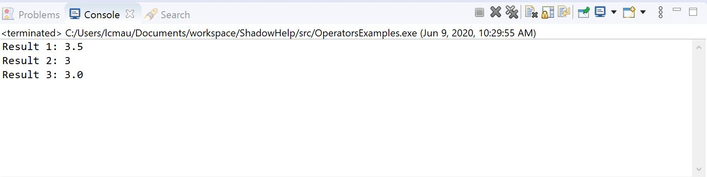

Operators and Expressions
-------------------------

Assignment
^^^^^^^^^^

In the "Variables Introduction" section, assigning a variable a particular value is briefly touched on. For example, consider the following line of code:  

.. code-block:: shadow 

    double height = 5.4; 

In this instance, the variable **height** is *assigned* the value 5.4. Another example would be 

.. code-block:: shadow

    int total = 6 + 6; 

The variable **total** is *assigned* the result of the evaluated **expression** 6 + 6, which is 12. 

While these two examples constitute the basics of assignment, Shadow also has some unique features that help streamline the more complicated examples of assignment. See below. 

.. code-block:: shadow 

    int x; //Line 1
    int y; //Line 2
    int z; //Line 3
    (x, y) = (3, 6); //Line 4
    (x, y) = (y, x); //Line 5
    (x, y, z) = 10; //Line 6

The above section of code demonstrates a few Shadow syntactic structures: **sequences** and two of its subtypes, **swaps** and **splats**. In the first three lines of code, the variables **x**, **y**, and **z**  are declared but not **initialized**. However, in Line 4, variables **x** and **y** are initiated in a single line. This is a basic **sequence**. Line 5 is an example of a **swap** because now **x** has a value  6 and **y** has value 3. Lastly, Line 6 is called a **splat** because all three variables are set to 10 in the same line. 

Arithmetic Operators
^^^^^^^^^^^^^^^^^^^^ 

Arithmetic operators in Shadow appear mostly as they would in an elementary math class. See the list below (in order of precedence).

* "\*" is used for multiplication
* "/" is used for division 
* "%" is used for modular division
* "+" is used for addition
* "-" is used for subtraction

**Precedence with Arithmetic Operators Examples**

In Shadow, multiplication and division take precedence over addition and subtraction. In order to avoid unintended output, it is good programming practice to use parentheses to manipulate the order of operations. The short programs below shows basic expressions using Shadow arithmetic operators.  

First, let's examine some nuances of **Shadow division**. 

.. code-block:: shadow 

    import shadow:io@Console;  

    class OperatorsExamples
    {
	 public main( String[] args ) => () 
         {
	 	
	 	double divide = 7.0/2; 
	 	Console.printLine("Result 1: " # divide); 
	 	/*When using the "/" for division, if either the operator or operand is a 
	 	 double, the result will be a double (double division). */
	 	
	 	int divide2 = 7/2; 
	 	Console.printLine("Result 2: " # divide2); 
	 	/* If the operator and operand are both ints, then the result will 
	 	by a non-rounded whole number (decimal point is "cut off"). 
	 	*/
	 	
	 	double divide3 = 7/2; 
	 	Console.printLine("Result 3: " # divide3); 
	 	/* Although both the operator and operand are ints, the variable
	 	divide3 is a double. What happens? First, the expression to the right 
	 	of the equals sign is evaluated. Since both numbers are ints, 
	 	the result is also an int: 3. Assignment happens SECOND. Shadow recognizes
	 	that the result must be stored as a double, so now divide3 holds the value 3.0, 
	 	not 3.5 -- which is a common mistake. 
	 	*/
	 	 
	 }
    }

Below is the console output for the above program: 

.. note:: You will cause a compile error if you try to store the result of double division in an int. 

Lastly, this program below provides a few extra examples of using the arithmetic operators. 

.. code-block:: shadow 

    import shadow:io@Console;  

    class ArithmeticOperators
    {
	public main( String[] args ) => () 
	{
		int expression1 = 6 / 3 * 2 + 1; 
		//expression1 = 5
		//Evaluated from left to right: (6/3) = 2; (2*2) = 4; (4+1) = 5  
		
		int expression2 = 10 % 2; 
		//expression2 = 0
		
		int expression3 = 10 % 3; 
		//expression3 = 1 
	}
    }

.. note:: Modular division is useful when trying to determine if a number is even or odd. 

Relational Operators
^^^^^^^^^^^^^^^^^^^^

Relational operators in Shadow are used to make comparisons and evaluate to one of two values: **true** or **false**. See the list below (in order of precedence)

* == "equal to". *See note below.*
* != "not equal to" 
* > "greater than" 
* < "less than"
* >= "greater than or equal to" 
* <= "less than or equal to" 
* && "AND"
* || "OR"

**A note on ==**

When comparing two numeric values, **==** works in the way you would expect. For example, 

.. code-block:: shadow 

    boolean test = (6 == 6); 

The variable **test** is assigned **TRUE**. However, suppose you wanted to compare two String variables using **==**. What would the result be?  Consider: 

.. code-block:: shadow 

    String want = “coffee”; 
    String need = “coffee”;
    boolean compare = (want == need); 

