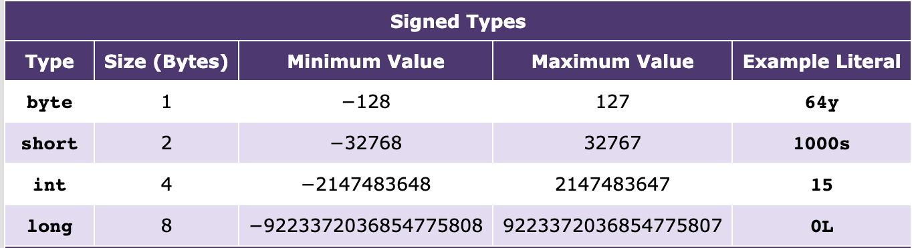
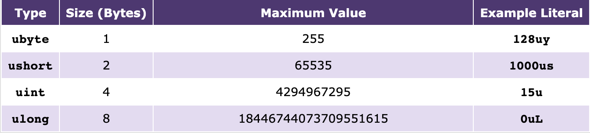

----------------------
Variables Introduction
----------------------

One key concept common for almost every programming language is called a variable. Just like in mathematics where you might say 3x = 24 (where x is the variable), variables in Shadow hold values. 

Numeric Types
^^^^^^^^^^^^^

Key **numeric type** variables, which are examples of **primitive variables** and store **literal values**, are listed with their sizes and ranges below:

In addition to the above integer-like types, Shadow also has two types of variables for storing **floating-point values** (i.e. 10.4 or 12.3564): **double** and **float.**

Unlike Java, Shadow has **unsigned types** for primitive variables as well. For example, an unsigned “int” is represented as “uint”. However, casting is still needed if you want to store an uint in an int, or vice versa. Due to strict Shadow type-checking, exercise caution when using unsigned variables.

.. note:: There is no udouble or ufloat class!

As an example, a basic variable declaration of type **int** looks like this: 

.. code-block:: shadow

    int age = 20; 

The **variable** age is of **primitive** type **int** and holds the **literal value** 20.

Boolean
^^^^^^^

There is one other primitive type: **boolean**.  A boolean variable can hold one of two values -- **true** or **false**. 

For example, 

.. code-block:: shadow

    boolean isBeautiful = true; 

The **variable** isBeautiful is of **primitive** type boolean and holds the value “true.” 

Strings and Immutability
^^^^^^^^^^^^^^^^^^^^^^^^^

Although Strings will be discussed more in-depth in a later tutorial, the basics are outlined here. 

While it appears that a Shadow variable can be declared of type **String**, you are actually creating an object of the String class (see “Shadow Classes”). This means that unlike a numeric variable which holds a literal value (like the number 20), String variables hold **references** (a location in memory) to an object. 

For example, 

Let’s use our age variable again (int age = 20;). If you had a birthday and wanted to update your age, you could write the following line of code: 

.. code-block:: shadow

    age = 21; 

Now the variable age is updated and holds the literal value of 21. Notice how I did not write 

.. code-block:: shadow

    int age = 21; 

This code would not compile because the age variable is already declared and **cannot be declared twice**. You are not trying to create a whole new age variable; you are simply changing its value. 

However, now consider the following String variable. 

.. code-block:: shadow

    String name = "Olivia"; // note: you must put the characters in quotes

Let’s say you wanted to change your name to “Stephanie.” :

.. code-block:: shadow 

    name = "Stephanie"; 

While this statement is legal and would compile, it is important to note that you are not changing the literal value of the name variable. Because Strings hold references to an object, you are actually creating a new reference to a new object that the variable name now points to. Thus, we say that Strings are **immutable**.  

Code Example
^^^^^^^^^^^^

.. code-block:: shadow
 
    import shadow:io@Console;  

    /*This is a short bit of code the demonstrates how to the declare the variable 
    types defined above. */

    class VariableExample
    {
	public main( String[] args ) => () 
	{	
		String restaurantName = "Taco Tuesday"; 
		boolean isHungry = true; 
	
		String meal = "Meat and Bean Burrito"; 
		int quantity = 2; 
		double price = 5.50; 
		
		Console.printLine("I love eating at " # restaurantName # "."); 
		Console.printLine("I would like " # quantity # " " # meal # "(s).");  
	}
	
    }

 
